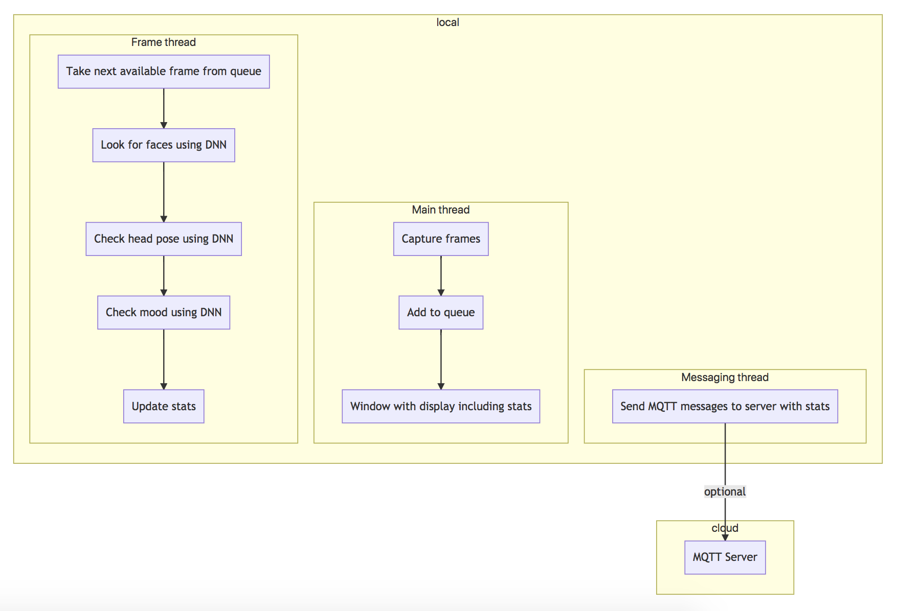

# Shopper Sentiment Monitor

| Details            |              |
|-----------------------|---------------|
| Target OS:            |  Ubuntu\* 16.04 LTS   |
| Programming Language: |  C++\* |
| Time to Complete:    |  45 min     |


## Introduction

This machine operator safet application is one of a series of reference implementations for Computer Vision (CV) using the OpenVINO™ toolkit. This application is designed for a machine mounted camera system that monitors if the operator is looking at the machine and if his emotional state is detected as angry. It sends an alert if either the operator is not watching the machine while it is in operation and if their emotional state is angry and this states lasts for longer than a user-defined period of time.

This example is intended to demonstrate how to ensure the machine operator safety.

## Requirements

### Hardware
* 6th Generation Intel® Core™ processor with Intel® Iris® Pro graphics and Intel® HD Graphics

### Software
* [Ubuntu\* 16.04 LTS](http://releases.ubuntu.com/16.04/)
*Note*: You must be running kernel version 4.7+ to use this software. We recommend using a 4.14+ kernel to use this software. Run the following command to determine your kernel version:
```
uname -a
```
* OpenCL™ Runtime Package
* OpenVINO™ toolkit

## Setup

### Install OpenVINO™ Toolkit
Refer to https://software.intel.com/en-us/articles/OpenVINO-Install-Linux for more information about how to install and setup the OpenVINO™ toolkit.

You will need the OpenCL™ Runtime package if you plan to run inference on the GPU as shown by the
instructions below. It is not mandatory for CPU inference.

## How it works

The application uses a video source, such as a camera, to grab frames, and then uses 3 different Deep Neural Networks (DNNs) to process the data. The first network detects faces, and then if successful it passes the result to the second neural network.

The second neural network is then used to determine if the machine operator is watching the machine i.e. if the operator's head is facing towards the camera.

Finally, the third neural network is then used to determine the emotion for the detected operator face if the operator is waching the machine.

The data can then optionally be sent to a MQTT machine to machine messaging server, as part of a industrial data analytics system.

The DNN models used in this application are Intel® optimized models that are part of the OpenVINO™ toolkit.

You can find them here:

- `/opt/intel/computer_vision_sdk/deployment_tools/intel_models/face-detection-adas-0001`
- `/opt/intel/computer_vision_sdk/deployment_tools/intel_models/head-pose-estimation-adas-0001`
- `/opt/intel/computer_vision_sdk/deployment_tools/intel_models/emotions-recognition-retail-0003`



The program creates three threads for concurrency:

- main thread that performs the video i/o
- worker thread that processes video frames using the deep neural networks
- worker thread that publishes any MQTT messages

## Setting the build environment

You must configure the environment to use the OpenVINO™ toolkit one time per session by running the following command:
```
    source /opt/intel/computer_vision_sdk/bin/setupvars.sh
```

## Building the code

Start by changing the current directory to wherever you have git cloned the application code. For example:
```
    cd machine-safety-monitor
```

If you do not yet have a `build` directory create one:
```
    mkdir build
```

Then change to that directory:
```
    cd build
```

Now run the following commands:
```
    cmake ..
    make
```

Once the commands are finished, you should have built the `monitor` application executable.

## Running the code

To see a list of the various options:
```
    ./monitor -h
```

To run the application with the needed models using the webcam:
```
    ./monitor -m=/opt/intel/computer_vision_sdk/deployment_tools/intel_models/face-detection-adas-0001/FP32/face-detection-adas-0001.bin -c=/opt/intel/computer_vision_sdk/deployment_tools/intel_models/face-detection-adas-0001/FP32/face-detection-adas-0001.xml -mm=/opt/intel/computer_vision_sdk/deployment_tools/intel_models/emotions-recognition-retail-0003/FP32/emotions-recognition-retail-0003.bin -mc=/opt/intel/computer_vision_sdk/deployment_tools/intel_models/emotions-recognition-retail-0003/FP32/emotions-recognition-retail-0003.xml -pm=/opt/intel/computer_vision_sdk/deployment_tools/intel_models/head-pose-estimation-adas-0001/FP32/head-pose-estimation-adas-0001.bin -pc=/opt/intel/computer_vision_sdk/deployment_tools/intel_models/head-pose-estimation-adas-0001/FP32/head-pose-estimation-adas-0001.xml
```

### Hardware acceleration

This application can take advantage of the hardware acceleration in the OpenVINO toolkit by using the `-b` and `-t` parameters.

For example, to use the OpenVINO™ toolkit backend with the GPU in 32-bit mode:
```
    ./monitor -m=/opt/intel/computer_vision_sdk/deployment_tools/intel_models/face-detection-adas-0001/FP32/face-detection-adas-0001.bin -c=/opt/intel/computer_vision_sdk/deployment_tools/intel_models/face-detection-adas-0001/FP32/face-detection-adas-0001.xml -mm=/opt/intel/computer_vision_sdk/deployment_tools/intel_models/emotions-recognition-retail-0003/FP32/emotions-recognition-retail-0003.bin -mc=/opt/intel/computer_vision_sdk/deployment_tools/intel_models/emotions-recognition-retail-0003/FP32/emotions-recognition-retail-0003.xml -pm=/opt/intel/computer_vision_sdk/deployment_tools/intel_models/head-pose-estimation-adas-0001/FP32/head-pose-estimation-adas-0001.bin -pc=/opt/intel/computer_vision_sdk/deployment_tools/intel_models/head-pose-estimation-adas-0001/FP32/head-pose-estimation-adas-0001.xml -b=2 -t=1
```

To run the code using 16-bit floats, you have to both set the `-t` flag to use the GPU in 16-bit mode, as well as use the FP16 version of the Intel® models:
```
    ./monitor -m=/opt/intel/computer_vision_sdk/deployment_tools/intel_models/face-detection-adas-0001/FP16/face-detection-adas-0001.bin -c=/opt/intel/computer_vision_sdk/deployment_tools/intel_models/face-detection-adas-0001/FP16/face-detection-adas-0001.xml -mm=/opt/intel/computer_vision_sdk/deployment_tools/intel_models/emotions-recognition-retail-0003/FP16/emotions-recognition-retail-0003.bin -mc=/opt/intel/computer_vision_sdk/deployment_tools/intel_models/emotions-recognition-retail-0003/FP16/emotions-recognition-retail-0003.xml -pm=/opt/intel/computer_vision_sdk/deployment_tools/intel_models/head-pose-estimation-adas-0001/FP16/head-pose-estimation-adas-0001.bin -pc=/opt/intel/computer_vision_sdk/deployment_tools/intel_models/head-pose-estimation-adas-0001/FP16/head-pose-estimation-adas-0001.xml -b=2 -t=2
```

## Sample videos

There are several videos available to use as sample videos to show the capabilities of this application. You can download them by running these commands from the `shopper-gaze-monitor` directory:
```
    mkdir resources
    cd resources
    wget https://github.com/intel-iot-devkit/sample-videos/raw/master/face-demographics-walking-and-pause.mp4
    wget https://github.com/intel-iot-devkit/sample-videos/raw/master/face-demographics-walking.mp4
    cd ..
```

To then execute the code using one of these sample videos, run the following commands from the `shopper-gaze-monitor` directory:
```
    cd build
    ./monitor -m=/opt/intel/computer_vision_sdk/deployment_tools/intel_models/face-detection-adas-0001/FP32/face-detection-adas-0001.bin -c=/opt/intel/computer_vision_sdk/deployment_tools/intel_models/face-detection-adas-0001/FP32/face-detection-adas-0001.xml -mm=/opt/intel/computer_vision_sdk/deployment_tools/intel_models/emotions-recognition-retail-0003/FP32/emotions-recognition-retail-0003.bin -mc=/opt/intel/computer_vision_sdk/deployment_tools/intel_models/emotions-recognition-retail-0003/FP32/emotions-recognition-retail-0003.xml -pm=/opt/intel/computer_vision_sdk/deployment_tools/intel_models/head-pose-estimation-adas-0001/FP32/head-pose-estimation-adas-0001.bin -pc=/opt/intel/computer_vision_sdk/deployment_tools/intel_models/head-pose-estimation-adas-0001/FP32/head-pose-estimation-adas-0001.xml -i=../resources/face-demographics-walking-and-pause.mp4
```

### Machine to machine messaging with MQTT

If you wish to use a MQTT server to publish data, you should set the following environment variables before running the program:
```
    export MQTT_SERVER=localhost:1883
    export MQTT_CLIENT_ID=cvservice
```

Change the `MQTT_SERVER` to a value that matches the MQTT server you are connecting to.

You should change the `MQTT_CLIENT_ID` to a unique value for each monitoring station, so you can track the data for individual locations. For example:
```
    export MQTT_CLIENT_ID=shelf1337
```
